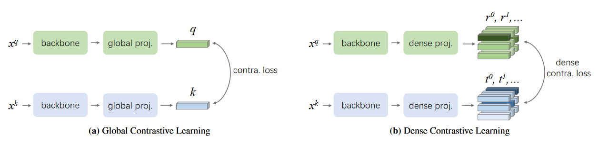

## DenseCL: Dense Contrastive Learning for Self-Supervised Visual Pre-Training


<p align="center">
  
</p>

This is an unofficial PyTorch implementation of the [DenseCL paper](https://arxiv.org/abs/2011.09157), with the help and suggestions from @WXinlong and @DerrickWang005.

Currently, [regionCL-D](https://arxiv.org/abs/2111.12309) is added, and pretrained checkpoints are uploaded.


### Preparation

Install PyTorch and ImageNet dataset following the [official PyTorch ImageNet training code](https://github.com/pytorch/examples/tree/master/imagenet).

This repo aims to be minimal modifications on that code. Check the modifications by:
```
diff main_densecl.py <(curl https://raw.githubusercontent.com/pytorch/examples/master/imagenet/main.py)
diff main_lincls.py <(curl https://raw.githubusercontent.com/pytorch/examples/master/imagenet/main.py)
```


### Unsupervised Training & Linear Classification

This implementation only supports **multi-gpu**, **DistributedDataParallel** training, which is faster and simpler; single-gpu or DataParallel training is not supported.

This implementation only supports **ResNet50/ResNet101**, since we need to modify computing graph architecture and I only modified ResNet50/ResNet101.

To do unsupervised pre-training and linear-evaluation of a ResNet50/ResNet101 model on ImageNet in an 8-gpu machine, please refer to [dist_train.sh](./dist_train.sh) for relevant starting script.

Since the paper says they use default mocov2 hyper-parameters, the above script uses same hyper-parameters as mocov2.

***Note***: for 4-gpu training, we recommend following the [linear lr scaling recipe](https://arxiv.org/abs/1706.02677): `--lr 0.015 --batch-size 128` with 4 gpus. We got similar results using this setting.


Linear classification results on ImageNet using this repo with 8 GPUs :
<table><tbody>
<!-- START TABLE -->
<!-- TABLE HEADER -->
<th valign="bottom"></th>
<th valign="bottom">pre-train<br/>epochs</th>
<th valign="bottom">pre-train<br/>time</th>
<th valign="bottom">MoCo v1<br/>top-1 acc.</th>
<th valign="bottom">MoCo v2<br/>top-1 acc.</th>
<th valign="bottom">DenseCL<br/>top-1 acc.</th>
<th valign="bottom">RegionCL-D<br/>top-1 acc.</th>
<!-- TABLE BODY -->
<tr><td align="left">ResNet-50</td>
<td align="center">200</td>
<td align="center">53 hours</td>
<td align="center">60.8&plusmn;0.2</td>
<td align="center">67.5&plusmn;0.1</td>
<td align="center"> 63.8 &plusmn;0.1</td>
<td align="center"> -- &plusmn;0.1</td>
</tr>
<tr><td align="left">ResNet-101</td>
<td align="center">200</td>
<td align="center">--</td>
<td align="center">--</td>
<td align="center">--</td>
<td align="center"> 65.4 &plusmn;0.1</td>
<td align="center"> -- &plusmn;0.1</td>
</tr>
</tbody></table>

Here we run 5 trials (of pre-training and linear classification) and report mean&plusmn;std: the 5 results of MoCo v1 are {60.6, 60.6, 60.7, 60.9, 61.1}, of MoCo v2 are {67.7, 67.6, 67.4, 67.6, 67.3}.

Please be aware that though DenseCL cannot match mocov2 in the filed of classification, it is superior to mocov2 in terms of object detection. See [./detection](detection) for details.


### Models

Our pre-trained denseCL/RegionCL-D models can be downloaded as following:
<table><tbody>
<!-- START TABLE -->
<!-- TABLE HEADER -->
<th valign="bottom"></th>
<th valign="bottom">epochs</th>
<th valign="bottom">mlp</th>
<th valign="bottom">aug+</th>
<th valign="bottom">cos</th>
<th valign="bottom">top-1 acc.</th>
<th valign="bottom">model</th>
<th valign="bottom">md5</th>
<!-- TABLE BODY -->
<tr><td align="left"><a href="https://arxiv.org/abs/2011.09157">DenseCL R50</a></td>
<td align="center">200</td>
<td align="center">&#x2713</td>
<td align="center">&#x2713</td>
<td align="center">&#x2713</td>
<td align="center"> 63.8 </td>
<td align="center"><a href="https://github.com/CoinCheung/denseCL/releases/download/v0.0.1/r50_checkpoint_0199.pth.tar">download</a></td>
<td align="center"><tt>7cfc894c</tt></td>
</tr>
<tr><td align="left"><a href="https://arxiv.org/abs/2011.09157">DenseCL R101</a></td>
<td align="center">200</td>
<td align="center">&#x2713</td>
<td align="center">&#x2713</td>
<td align="center">&#x2713</td>
<td align="center">65.4</td>
<td align="center"><a href="https://github.com/CoinCheung/denseCL/releases/download/v0.0.1/r101_checkpoint_0199.pth.tar">download</a></td>
<td align="center"><tt>006675e5</tt></td>
</tr>
<tr><td align="left"><a href="https://arxiv.org/abs/2111.12309">RegionCL-D R50</a></td>
<td align="center">200</td>
<td align="center">&#x2713</td>
<td align="center">&#x2713</td>
<td align="center">&#x2713</td>
<td align="center">  </td>
<td align="center"><a href="https://github.com/CoinCheung/DenseCL/releases/download/v0.0.1/regioncl_r50_checkpoint_0199.pth.tar">download</a></td>
<td align="center"><tt>8afad30e</tt></td>
</tr>
<tr><td align="left"><a href="https://arxiv.org/abs/2111.12309">RegionCL-D R101</a></td>
<td align="center">200</td>
<td align="center">&#x2713</td>
<td align="center">&#x2713</td>
<td align="center">&#x2713</td>
<td align="center"></td>
<td align="center"><a href="https://github.com/CoinCheung/DenseCL/releases/download/v0.0.1/regioncl_r101_checkpoint_0199.pth.tar">download</a></td>
<td align="center"><tt>a1489ad4</tt></td>
</tr>
</tbody></table>


### Transferring to Object Detection

For details, see [./detection](detection).


### License

This project is under the CC-BY-NC 4.0 license. See [LICENSE](LICENSE) for details.


regioncl, r50:  
    Acc@1 67.518 Acc@5 88.256  
    Acc@1 67.534 Acc@5 88.212  
regioncl, r101:  
    Acc@1 67.504 Acc@5 88.212
    Acc@1 67.470 Acc@5 88.104
    
